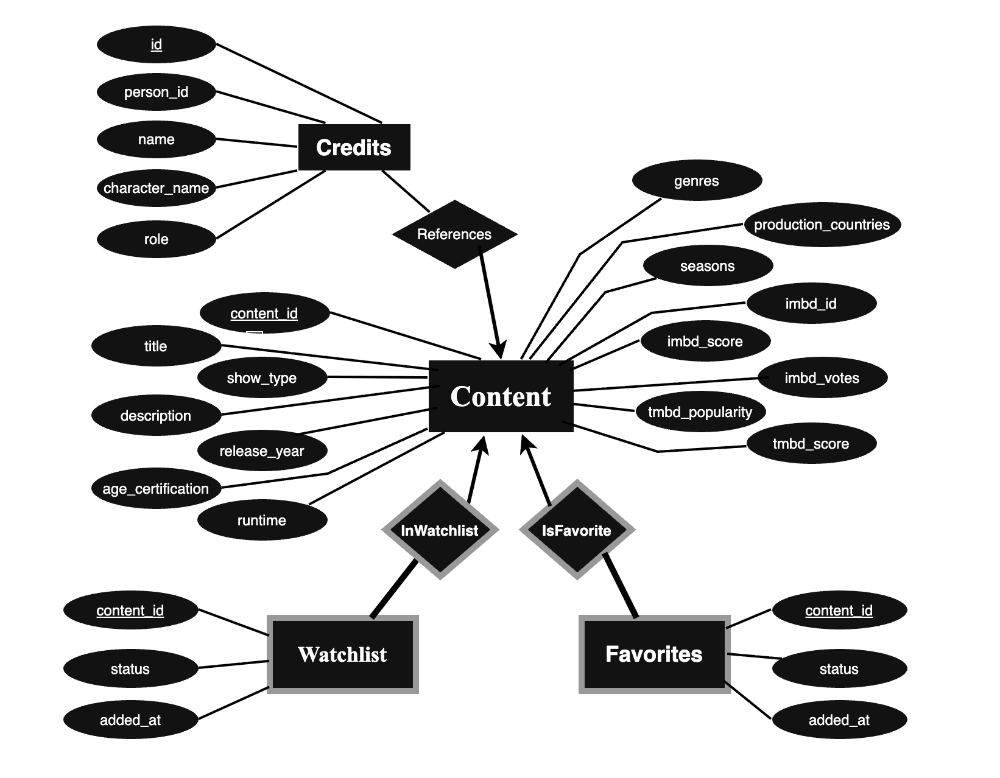

# DIS-Gruppeprojekt - WatchFlix Documentation

## Project description

Our web application is called 'WatchFlix'. It is a web application for browsing movies and TV shows. It utilizes the Flask micro-framework, a PostgreSQL database and Docker for packaging our environment into a container.

The functionality of our app is fairly simple due to time contstraints. The possible actions are:

- Browse movies and TV shows on the homepage
- add content to a watchlist 
- add content to a favourites list
- view the watchlist
- view favourites

## How to run our application and interact with it

Clone the repository to the preferred location.

As our application relies on Docker, Docker must be installed and running before attempting to start the container. Only when this is done:

navigate to the location of the '/DIS-Gruppeprojekt/flask-project' folder and run:

```bash
docker compose up
```

which builds the container, then create a new terminal window and navigate to location of the '/DIS-Gruppeprojekt/flask-project' again and run the initialization script:

```bash
docker compose exec web python db_initialization.py
```

The command docker compose exec *container name* *command* executes a command inside the specified container which in our case is called 'web' and then runs our script `db_initialization.py` which creates new tables and populates them with our data from the `/data` folder.

Paste this address in the preferred browser

http://127.0.0.1:5001

This will display our homepage. Clicking the interactive 'Favorites' or 'Watchlist buttons' will send you to the Favorites and Watchlist pages. Or you can paste in these addresses:

http://127.0.0.1:5001/favorites
http://127.0.0.1:5001/watchlist

To add a movie or show to favorites and/or watchlist press the "Add to watchlist" or "Favorite" button on the preferred movie(s).

---

## Project structure

```text
flask-project/
│
├── app.py
├── database.py
├── db_initialization.py
├── docker-compose.yml
├── Dockerfile
├── entrypoint.sh
├── pyproject.toml
│
├── controllers/
│   ├── homepage.py
│   ├── watchlist.py
│   └── favorites.py
│
├── models/
│   ├── homepage.py
│   ├── watchlist.py
│   └── favorites.py
│
├── templates/
│   ├── index.html
│   ├── watchlist.html
│   └── favorites.html
│
├── static/
│   ├── style.css
│   └── er-diagram.jpg
│
└── data/
    ├── titles.csv
    └── credits.csv
```

Our project follows the MVC structure. We have relied heavily on the handed out implementation on https://github.com/rafaelcgs10/dis2025/tree/main/minimal_mvc_pg:

- `controllers/` handles routes and user requests
- `models/` handles database queries
- `templates/` contains the HTML pages
- `static/` contains CSS and static files

Other non-trivial files:
- `database.py` handles database connection 
- `db_initialization.py` handles the creation of the tables and the logic for populating them
- `app.py` handles instanziation of the Flask obejct, registration of blueprints and running the app
---

## E/R diagram



The E/R diagram shows the current state of our WatchFlix database.

The main entity set is `Content`, which represents both movies and TV shows. We chose to use one shared `Content` entity instead of separate entities for movies and TV shows, because both types share the exact same attributes, such as content_id, title, content type, release year etc.

We have two weak etities `Favorites` and `Watchlist` with their owner being the Content entity set. These tables store the content that the person interacting with the web application, adds to the lists. They are weak as they can only be identified by `Content`'s primary key 'content_id' which they reference in their tables. 
They also store a `status`, for example whether the content is in the watchlist or marked as a favourite.

The `Credits` entity set stores information about actors and directors. Since one actor/director can appear in many different movies or shows, and one movie or show can have many actors and directors, this is a many-to-many relation. Allthough we don't utilize them in our application (yet) we have still created a table and populated it to show how they relate to Content (see `db_initialization.py`) and to have the possibility of extending our app to also utilize `Credits`.


**TILFØJ/OPDATER med resten af info fra opdateret ER DIAGRAM**

---

## Implemented database tables

The implemented version of the database contains the following tables:

```text
Content(
    content_id,
    title,
    show_type,
    description,
    release_year,
    age_certification,
    runtime,
    genres,
    production_countries,
    seasons,
    imdb_id,
    imdb_score,
    imdb_votes,
    tmdb_popularity,
    tmdb_score
)

Credits(
    id,
    person_id,
    content_id,
    name,
    character_name,
    role
)

Watchlist(
    content_id,
    status,
    added_at
)

Favourites(
    content_id,
    status,
    added_at
)
```

- The table `Content` stores movie and TV show information. This includes title, type, release year, runtime, genre and IMDb score.
- The `Credits` table stores actor and director data and content_id which is the way that Credits relate to Content.
- The `Watchlist` table stores content added to the watchlist.
- The `Favourites` table stores content added to favourites.
- The implemented database is however only partially used, as we don't utilize the `Credits` table yet

---

## Limitations and ambiguities

Allthough we both were very ambitious in the beginning of the project, wanting to implement different sorting algorithms displaying the convenience of the relation between Content and `Credits` or the ability to host multiple users, we realized later on that there goes a lot of work into actually setting up and getting to know all the different software and files. 

We therefore adjusted our expectations so that our application does not feature any users with unique usernames and passwords. Furthermore we have implemented `Credits` in our db_initialization.py script but we never utilize it after instantiating it. If we had more time we would have implemented the neccesary logic and styling to display and search after movies based on specific actors or directors.

Our application does not feature any unit test, which is also problematic as we cannot assure for the correctness of our code. We have however "played" around with the application and investigated it's behaviour through exploring differnet scenarios such as adding movies and shows to the watchlist and favorites, respectively, adding the same movie twice, investigating and then controlled the extend of the displayed content. 

For example, we choose to display only the first 500 movies and tv-shows on the homepage instead of the actual thousands. We did this as the performance was very bad but to change this you can change or remove the limit of instances shown, at *line 12 in flask-project/models/homepage.py*.

If we had more time we would have made unit tests that tested each functionality, for example testing that check a movie (after being added to favorites) actually does exist in the actual Favorites table.

We are also aware that the content can't be deleted once added to one of the lists, but we did not have the time.

We used a different port (port 5001 instead of standard port 5000) to avoid port conflicts as we are both working on Macs where port 5000 is already occupied.

___

## How to stop the application

To stop the application, press:

```bash
CTRL + C
```

in the terminal where Docker Compose is running.

To remove the running containers, run:

```bash
docker compose down
```

Or reset the database completely, including the database volume, run:

```bash
docker compose down -v
```

After this, the database will be recreated the next time the application is started.

---

## AI declaration

We have used Generative AI for the project. The following LLM's was used: 

ChatGPT was used for:

- understanding Flask, Docker and PostgreSQL errors
- debugging route, template and database issues

and Gemini was used to:

- Debugging/clarifying error messages
- Understanding/learning the flask-micro framework and Docker in order to utilize it
- Documentation lookups 

